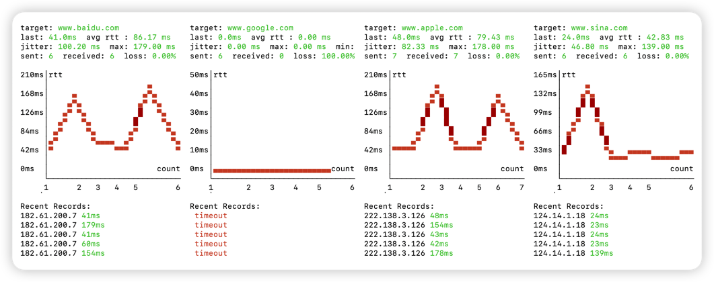

<h1 align="center"> 🏎 Nping </h1>
<p align="center">
    <em>Nping is a Ping tool developed in Rust using the ICMP protocol. It supports concurrent Ping for multiple addresses, visual chart display, real-time data updates, and other features.</em>
</p>
<p align="center">
    
</p>

[中文文档](./README_ZH.md)




## Feature:
- Supports concurrent Ping for multiple addresses
- Supports visual latency display
- Real-time display of maximum, minimum, average latency, packet loss rate, and other metrics

## TODO:
- Support dynamic layout display
- Implement a better-looking UI

## Usage

```bash
# Since the pnet package is used, root privileges are required
sudo nping www.baidu.com www.google.com www.apple.com www.sina.com -c 20

# nping --help

nping with concurrent, chart, multiple addresses, real-time data update

Usage: nping [OPTIONS] <TARGET>...

Arguments:
  <TARGET>...  target IP address or hostname to ping

Options:
  -c, --count <COUNT>        Number of pings to send [default: 10000]
  -i, --interval <INTERVAL>  Interval in seconds between pings [default: 0]
  -s, --size <SIZE>          Packet size [default: 32]
  -h, --help                 Print help
  -V, --version              Print version